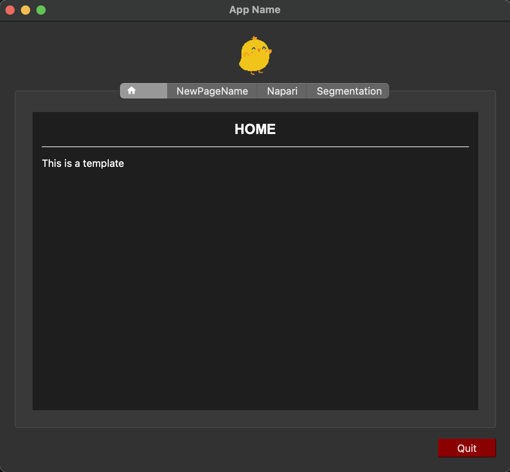

<!-- PROJECT SHIELDS -->
<!--
*** I'm using markdown "reference style" links for readability.
*** Reference links are enclosed in brackets [ ] instead of parentheses ( ).
*** See the bottom of this document for the declaration of the reference variables
*** for contributors-url, forks-url, etc. This is an optional, concise syntax you may use.
*** https://www.markdownguide.org/basic-syntax/#reference-style-links
-->
[![Issues][issues-shield]][issues-url]
[![LinkedIn][linkedin-shield]][linkedin-url]

<!-- PROJECT LOGO -->
 

  <h3 align="center">PyQt5 App Template</h3>

  

    ·
    <a href="https://github.com/ariannaravera/pyqt5-app-template/issues">Report Bug</a>
    ·
    <a href="https://github.com/ariannaravera/pyqt5-app-template/issues">Request Feature</a>
  

<!-- TABLE OF CONTENTS -->

  
Table of Contents

  <ol>
    <li>
      <a href="#about-the-project">About The Project</a>
    </li>
    <li>
      <a href="#getting-started">Getting Started</a>
      <ul>
        <li><a href="#installation">Installation</a></li>
        <li><a href="#prerequisites">Prerequisites</a></li>
      </ul>
    </li>
    <li><a href="#contributing">Contributing</a></li>
    <li><a href="#contact">Contact</a></li>
  </ol>

<!-- ABOUT THE PROJECT -->
## About The Project

PyQt5 App template

<a href="#readme-top">back to top</a>

<!-- GETTING STARTED -->
## Getting Started

### Installation
The use of Anaconda is supposed.
 
1. Create a virtual environment for your code, in the terminal: 

  `conda create --name name_of_venv`
  
2. Clone this git repository. Open the terminal where you want to put the App code (eg. Desktop): 

  `git clone https://github.com/ariannaravera/pyqt5-app-template.git`
 
Now you have the pyqt5-app-template folder into the chosen directory (eg. Desktop/pyqt5-app-template)
 
3. Open the terminal within the pyqt5-app-template folder, activate your venv and install the libraries running:

  `conda activate name_of_venv`  
  `pip install -r requirements.txt`
 
  (If you have troubles with pyqt, try to install if in this way:  
  `pip install pyqt5 --config-settings --confirm-license= --verbose`)
 
Now you have everything you need!

4. To open the application, run:
  
  `python3 master.py`

### Prerequisites

List of things you need to use the software and how to install them.
* PyQt5==5.15.9
* PyQt5_sip==12.12.1
* napari==0.4.17

<a href="#readme-top">back to top</a>

<!-- CONTRIBUTING -->
## Contributing

Contributions are what make the open source community such an amazing place to learn, inspire, and create. Any contributions you make are **greatly appreciated**.

If you have a suggestion that would make this better, please fork the repo and create a pull request. You can also simply open an issue with the tag "enhancement".
Don't forget to give the project a star! Thanks again!

1. Fork the Project
2. Create your Feature Branch (`git checkout -b feature/AmazingFeature`)
3. Commit your Changes (`git commit -m 'Add some AmazingFeature'`)
4. Push to the Branch (`git push origin feature/AmazingFeature`)
5. Open a Pull Request

<a href="#readme-top">back to top</a>

<!-- CONTACT -->
## Contact

Arianna Ravera - ariannaravera22@gmail.com

<a href="#readme-top">back to top</a>

<!-- MARKDOWN LINKS & IMAGES -->
<!-- https://www.markdownguide.org/basic-syntax/#reference-style-links -->
[contributors-shield]: https://img.shields.io/github/contributors/ariannaravera/pyqt5-app-template.svg?style=for-the-badge
[contributors-url]: https://github.com/ariannaravera/pyqt5-app-template/graphs/contributors
[forks-shield]: https://img.shields.io/github/forks/ariannaravera/pyqt5-app-template.svg?style=for-the-badge
[forks-url]: https://github.com/ariannaravera/pyqt5-app-template/network/members
[stars-shield]: https://img.shields.io/github/stars/ariannaravera/pyqt5-app-template.svg?style=for-the-badge
[stars-url]: https://github.com/ariannaravera/pyqt5-app-template/stargazers
[issues-shield]: https://img.shields.io/github/issues/ariannaravera/pyqt5-app-template.svg?style=for-the-badge
[issues-url]: https://github.com/ariannaravera/pyqt5-app-template/issues
[license-shield]: https://img.shields.io/github/license/ariannaravera/pyqt5-app-template.svg?style=for-the-badge
[license-url]: https://github.com/ariannaravera/pyqt5-app-template/blob/master/LICENSE.txt
[linkedin-shield]: https://img.shields.io/badge/-LinkedIn-black.svg?style=for-the-badge&logo=linkedin&colorB=555
[linkedin-url]: https://www.linkedin.com/in/arianna-ravera-3a082917b
[product-screenshot]: support_files/Screenshot.png
[Python.com]: https://img.shields.io/badge/python-35495E?style=for-the-badge&logo=python&logoColor=green
[Python-url]: [https://pythonprogramminglanguage.com]
<!-- [JQuery.com]: https://img.shields.io/badge/jQuery-0769AD?style=for-the-badge&logo=jquery&logoColor=white
[JQuery-url]: https://jquery.com  -->
